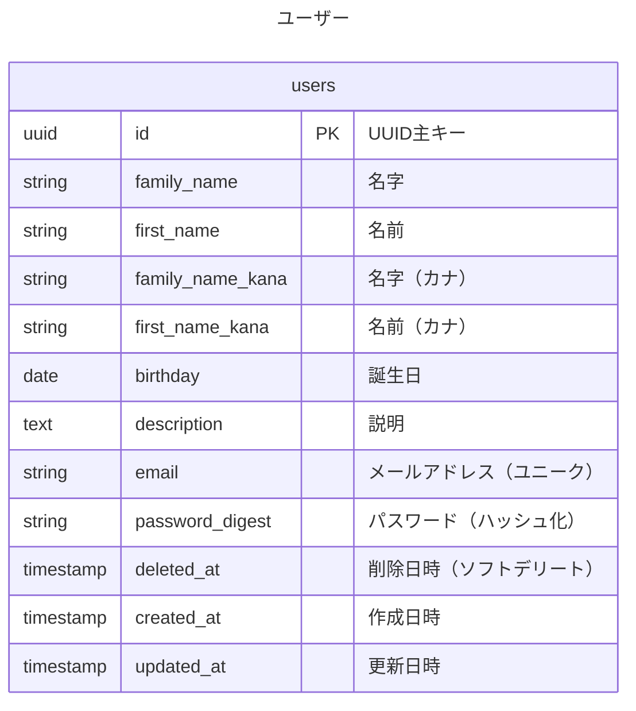
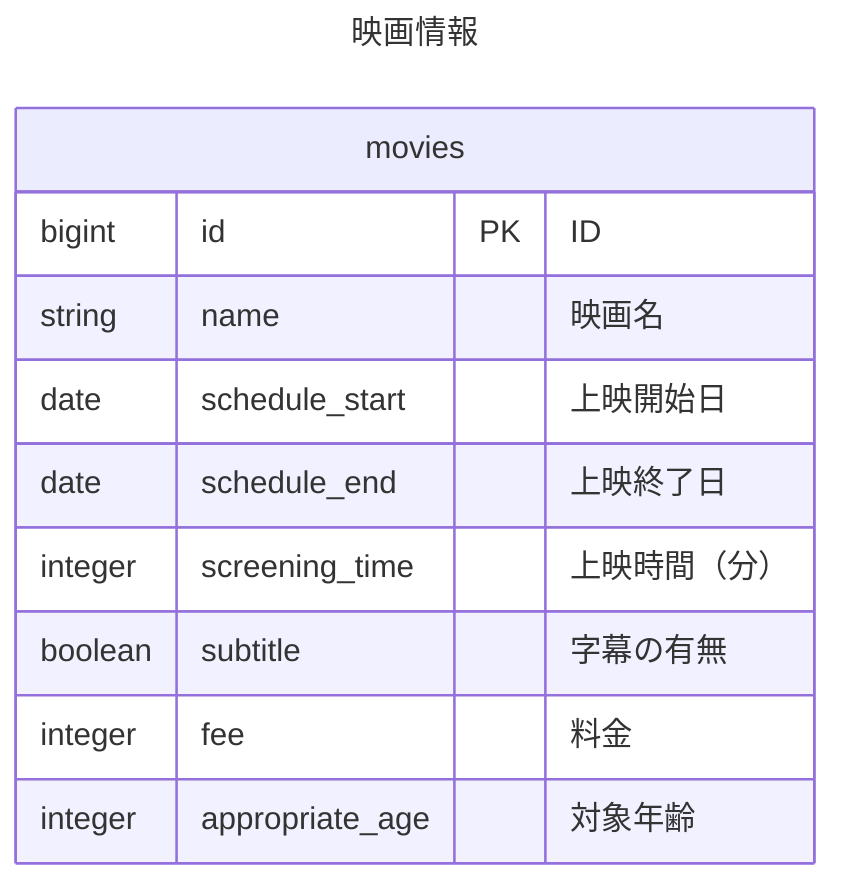
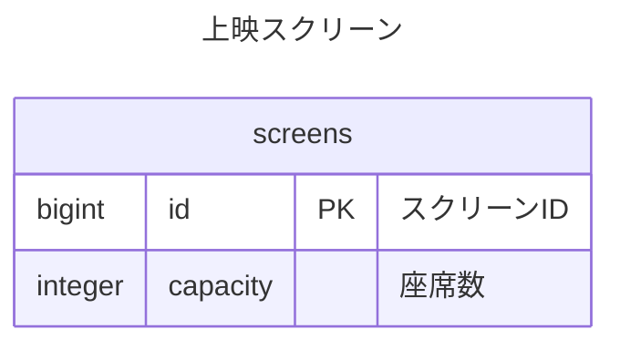
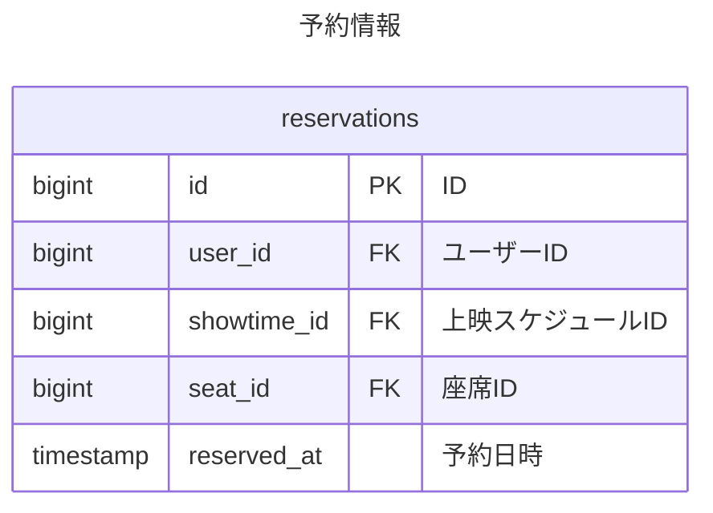
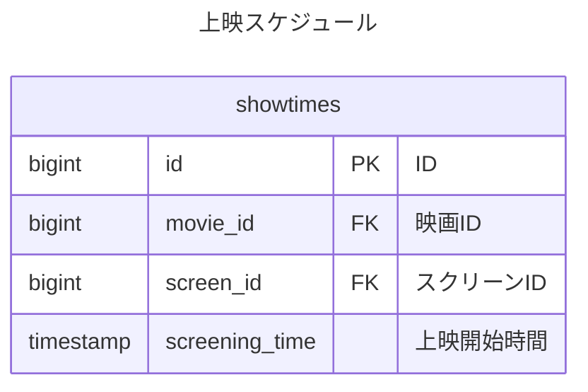
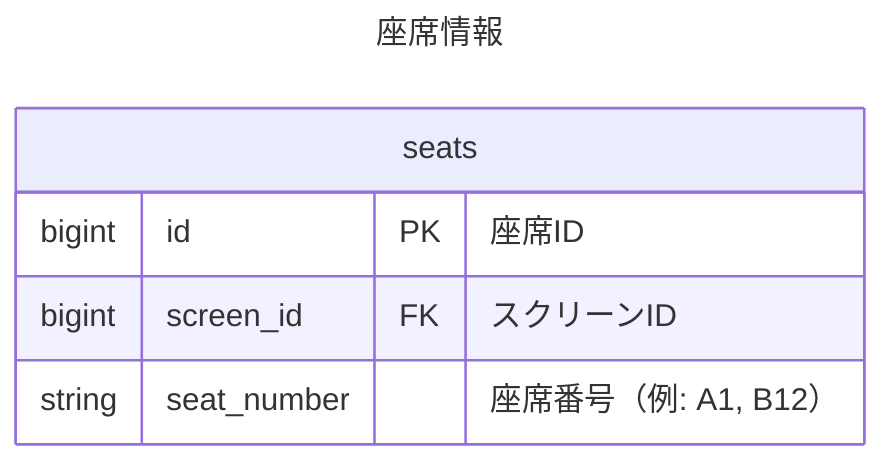

```mermaid
---
title: "ユーザー"
---
erDiagram
    users {
        uuid id PK "UUID主キー"
        string family_name "名字"
        string first_name "名前"
        string family_name_kana "名字（カナ）"
        string first_name_kana "名前（カナ）"
        date birthday "誕生日"
        text description "説明"
        string email "メールアドレス（ユニーク）"
        string password_digest "パスワード（ハッシュ化）"
        timestamp deleted_at "削除日時（ソフトデリート）"
        timestamp created_at "作成日時"
        timestamp updated_at "更新日時"
    }

```

```mermaid
---
title: "映画情報"
---
erDiagram
    movies {
        bigint id PK "ID"
        string name "映画名"
        date schedule_start "上映開始日"
        date schedule_end "上映終了日"
        integer screening_time "上映時間（分）"
        boolean subtitle "字幕の有無"
        integer fee "料金"
        integer appropriate_age "対象年齢"
    }


```

```mermaid
---
title: "上映スクリーン"
---
erDiagram
    screens {
        bigint id PK "スクリーンID"
        integer capacity "座席数"
    }


```

```mermaid
---
title: "予約情報"
---
erDiagram
    reservations {
        bigint id PK "ID"
        bigint user_id FK "ユーザーID"
        bigint showtime_id FK "上映スケジュールID"
        bigint seat_id FK "座席ID"
        timestamp reserved_at "予約日時"
    }

```

```mermaid
---
title: "上映スケジュール"
---
erDiagram
    showtimes {
        bigint id PK "ID"
        bigint movie_id FK "映画ID"
        bigint screen_id FK "スクリーンID"
        timestamp screening_time "上映開始時間"
    }


```

```mermaid
---
title: "座席情報"
---
erDiagram
    seats {
        bigint id PK "座席ID"
        bigint screen_id FK "スクリーンID"
        string seat_number "座席番号（例: A1, B12）"
    }
```